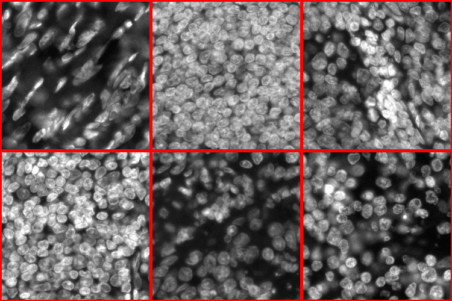

# Segmentation

The segmentation pipeline is based on [IMCSegmentationPipeline](https://github.com/BodenmillerGroup/ImcSegmentationPipeline) which is based on Ilastik and CellProfiler for pixel classification and segmentation, respectively. This pipeline is a machine learning based segmentation pipeline in which we first select a small portion of the dataset (Step 1) in order to use for training the model via mannual annotation of the training dataset (Step 2). Next the trained model will be applied to the entire dataset (Step 3) resulting in a "probability" image of the dataset. The probability image will be used in the CellProfiler software in order to create a segmentation mask (Step 4).

Details of abovementioned steps are as follows:

## Step 1. Preparing the output of the Pre-Processing for Segmentation:

In this step, the user should open the Segmentation dataset in Fiji and select, duplicate, and save 5 to 10 small square-sized FOVs of it in a working directory. All channels of the segmentation dataset should be included in the small images. The pixel size of the small FOVs may vary depending on the objective that is used for imaging but 250 pixel for 20x objectives and 500 pixel for 40x objectives are our recommendation. The user should try to select the small FOVs from regions of the image with different cell density and morphology. This way, the trained model will be more generic for segmenting th entire image. Figure 1 shows an example of 6 regions that we selected from the sample dataset. The images show the DAPI channel. Our point here is to show that each of the selected regions have distinct morphological characteristics as well as clear differences in their cell density. 

   Figure 1
   

## Step 2. Training the pixel classifier
The following steps are done in the Ilastik software: 

   1. make a new *pixel classification project*. Next, select Raw Data-> Add separate Images-> select all the small images made in step 1. 
     
   2. Navigate to *fearure selection* and select all the features that are above and equal to 1 pixel.
   
   3. Navigate to *Training* and first add three labels: 1. Nuclei (yellow), 2. Cytoplasm/Membrane (blue), 3. Background (red).
   
   4. After making the labels, user may Use the brush tool in order to annotate the images with various labels. The size of the brush can be changed by the *Size* drop down menu. User can switch among the channels (by using the box next *Raw input*) to fully label every single training image. For example, user can switch to the nuclei image and finish the labeling of all the neuclei based on that. Then by switching to membrane marker channels, user can label the cytoplasm/membrane and also the background which is the areas with no cells.
   
   In most of the tissues, areas with high cellular density are abundant with cells that are pressed together. The nuclei of these cells usually recognized as one nuclei by most segmentation algorithms. Here, user can find such nuclei and using the membrane label, annotate the low gray value border between each two close nuclei so that the classifier would learn that the dim line between two very close nuclei is the border between the two cells. 
   
   Here, user can also check the *uncertainities* to find locations within each image that still need more labeling by the user. If uncertainities are low within class regions and high on the border of two classes, then the labeling and subsequently the prediction in that area are efficient. 
   
   In general, the user does not need to annotate the entire image. But as a rule of thumb, the more the annotation, the higher would be the accuracy of the classifier. Figure 2 shows that by labeling only one cell in the left image, the classifier is able to efficiently label all othe nuclei and membrane of other cells. In this case, nnaccuracies such as connected nuclei can be addressed by labeling more cells. 
     
     
   Figure 2
        
     
     
   5. Once the classifier is well trained, Navigate to prediction export
     
